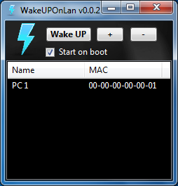

# WakeUpOnLan
Start a computer on local lan

### Download release:

https://github.com/ddeeproton/xmrig-nvidia-manager/tree/master/releases

### Download sources:

https://github.com/ddeeproton/xmrig-nvidia-manager/tree/master/sources

### Original source: 

https://codes-sources.commentcamarche.net/source/39318-wake-on-lan

# How to Build?

Download Lazarus for Windows and build it. 

http://www.lazarus-ide.org/index.php?page=downloads

# How to use?

You must be on the same network lan. 

Broadcasting must be allowed on the network.

Wake UP On Lan must be activated on BIOS.

You can use this application on command line, like this:

WakeUpOnLan.exe 00-00-00-00-00-00

Start in background:

WakeUpOnLan.exe /background

# Changes

### v1.0.0 

First commit

### v1.0.1

Add systray icon

Add start on boot

### v1.0.2

Add PopupMenu on ListMAC

### v1.0.3

Fix issue on Win32

### v1.0.4

Fix design

### v1.0.5

Fix issue on save and load
